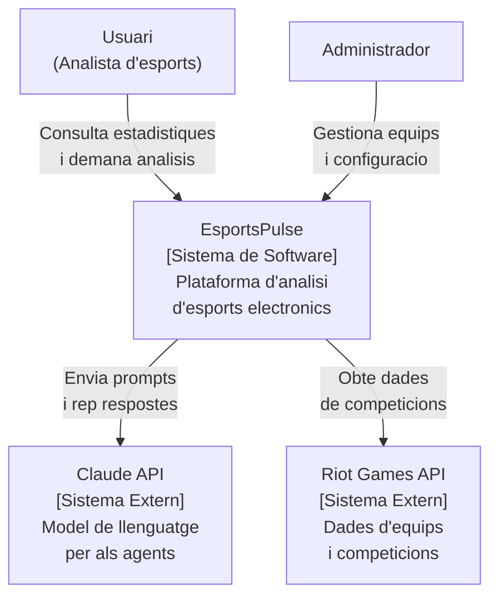
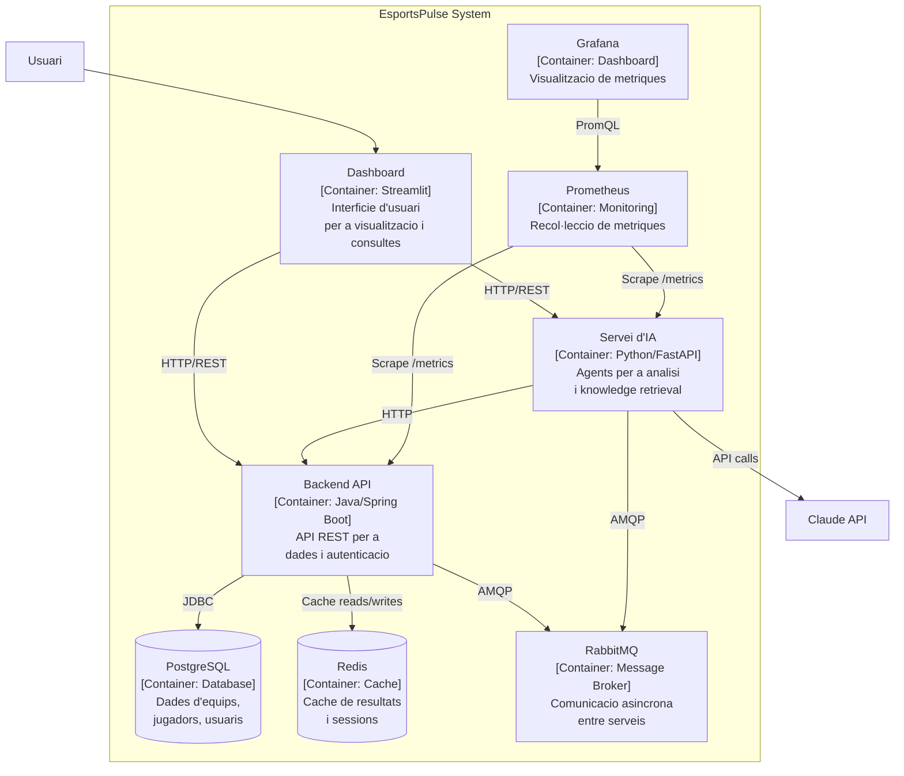
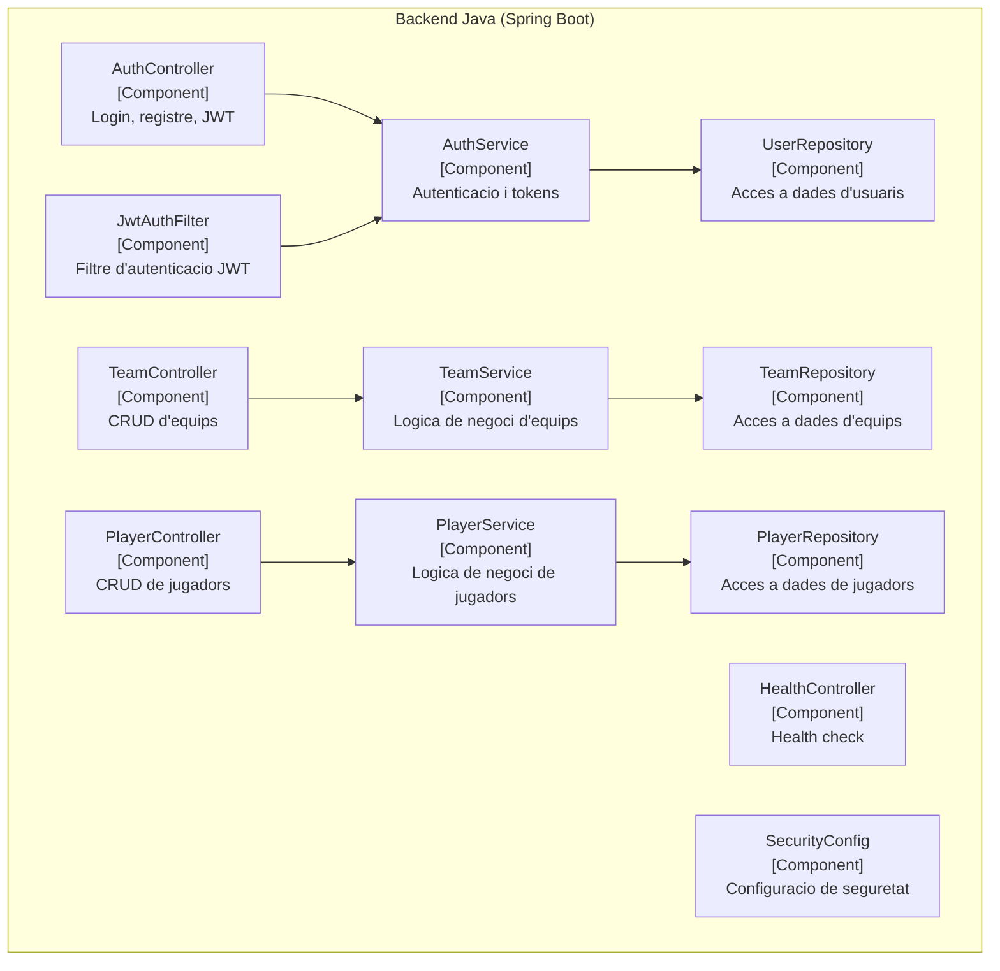
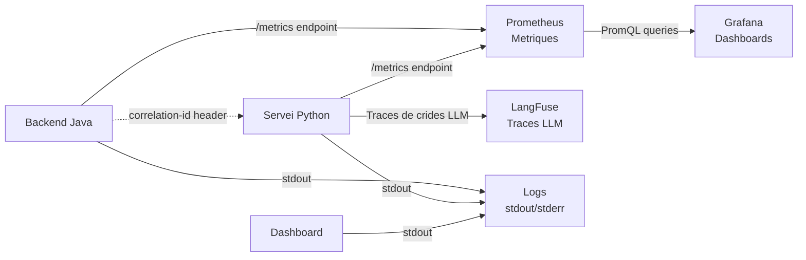

# Setmana 23 — Dimecres: Diagrames C4: Arquitectura Visual

## Objectiu del Dia

Crear els tres nivells de diagrames C4 (Context, Container, Component) del projecte EsportsPulse utilitzant eines basades en text (Mermaid o PlantUML). Al final del dia, tindras una representacio visual completa de l'arquitectura que podras incloure al README i a la documentacio.

---

## Teoria

### Que es el Model C4?

El model C4 (creat per Simon Brown) es una forma estandaritzada de visualitzar l'arquitectura de software. Te 4 nivells, com fer zoom en un mapa:

```
# Nivell 1: Context
# "Qui usa el sistema i amb que es connecta?"
# Mostra: el sistema com una caixa, els usuaris, i els sistemes externs
# Public: tothom (stakeholders, managers, devs)

# Nivell 2: Container
# "Quins contenidors (serveis) te el sistema?"
# Mostra: aplicacions, bases de dades, cues de missatges
# Public: equip tecnic

# Nivell 3: Component
# "Com esta organitzat internament cada contenidor?"
# Mostra: controladors, serveis, repositoris dins d'un servei
# Public: desenvolupadors del servei

# Nivell 4: Code (opcional)
# "Com es el codi?"
# Mostra: diagrames UML de classes
# Normalment no es fa (el codi ja esta al repositori)
```

### Diagrama de Context (Nivell 1)

El diagrama de context mostra el sistema des de fora:



### Diagrama de Containers (Nivell 2)

El diagrama de containers mostra els serveis interns:



### Diagrama de Components (Nivell 3)

Zoom dins d'un contenidor (per exemple, el Backend Java):



### Flux d'Observabilitat

Un diagrama addicional que mostra com flueixen els logs, metriques i traces:



---

## Activitat

### 1. Triar l'Eina (10 min)

**Opcio A: Mermaid (recomanat)**

Mermaid es renderitza directament a GitHub, GitLab, i moltes eines.

```bash
# No cal instal·lar res — GitHub renderitza Mermaid nativament
# Escriu els diagrames dins blocs ```mermaid``` al Markdown

# Per previsualitzar localment:
# - VS Code: extensio "Markdown Preview Mermaid Support"
# - Online: mermaid.live
```

**Opcio B: PlantUML**

```bash
# Instal·lacio amb Homebrew
brew install plantuml

# Generar imatge des d'un fitxer .puml
plantuml docs/architecture/c4-context.puml
```

### 2. Crear Diagrama de Context (20 min)

Crea `docs/architecture/c4-context.md`:

Pensa en:
- Qui son els actors que usen el sistema?
- Amb quins sistemes externs es connecta?
- Quines accions fa cada actor?

Escriu el diagrama Mermaid seguint l'exemple de la teoria, pero adaptat al TEU projecte real.

### 3. Crear Diagrama de Containers (30 min)

Crea `docs/architecture/c4-containers.md`:

Pensa en:
- Quins serveis tens al docker-compose?
- Com es comuniquen (HTTP, AMQP, JDBC)?
- Quins ports utilitzen?
- On estan les dades persistents?

```bash
# Referencia rapida: llista els serveis reals
docker-compose config --services

# Llista els ports exposats
docker-compose config | grep -A 5 "ports:"
```

### 4. Crear Diagrama de Components (30 min)

Crea `docs/architecture/c4-components-java.md` i `docs/architecture/c4-components-python.md`:

Per al backend Java:

```bash
# Llista les classes del controlador
find backend-java -name "*Controller.java" -type f

# Llista les classes del servei
find backend-java -name "*Service.java" -type f

# Llista els repositoris
find backend-java -name "*Repository.java" -type f
```

Per al servei Python:

```bash
# Llista els routers
find ai-python -name "*router*" -o -name "*route*" | grep -v __pycache__

# Llista els serveis
find ai-python -name "*service*" | grep -v __pycache__

# Llista els agents
find ai-python -name "*agent*" | grep -v __pycache__
```

### 5. Crear Diagrama d'Observabilitat (15 min)

Crea `docs/architecture/observability-flow.md`:

Inclou:
- D'on surten les metriques (endpoints `/metrics`)
- On van els logs (stdout -> plataforma)
- Com es propaguen els correlation IDs
- On es consulten les metriques (Grafana, LangFuse)

### 6. Integrar els Diagrames (15 min)

Afegeix els diagrames al CLAUDE.md i/o README:

```markdown
## Arquitectura

### Diagrama de Context
<!-- Mermaid diagram aqui -->

### Diagrama de Containers
<!-- Mermaid diagram aqui -->

Per als diagrames de components, consulta:
- [Components del Backend Java](docs/architecture/c4-components-java.md)
- [Components del Servei Python](docs/architecture/c4-components-python.md)
```

### 7. Commit (10 min)

```bash
git add docs/architecture/
git commit -m "docs: add C4 architecture diagrams (context, containers, components)"
```

---

## Checklist de Lliurament

- [ ] Diagrama de Context (Nivell 1) amb actors i sistemes externs
- [ ] Diagrama de Containers (Nivell 2) amb tots els serveis
- [ ] Diagrama de Components (Nivell 3) per al backend Java
- [ ] Diagrama de Components (Nivell 3) per al servei Python
- [ ] Diagrama de flux d'observabilitat
- [ ] Diagrames en format Mermaid (renderitzables a GitHub)
- [ ] Diagrames integrats al CLAUDE.md o README
- [ ] Tots els serveis reals del projecte reflectits als diagrames
- [ ] Commit amb tots els diagrames
