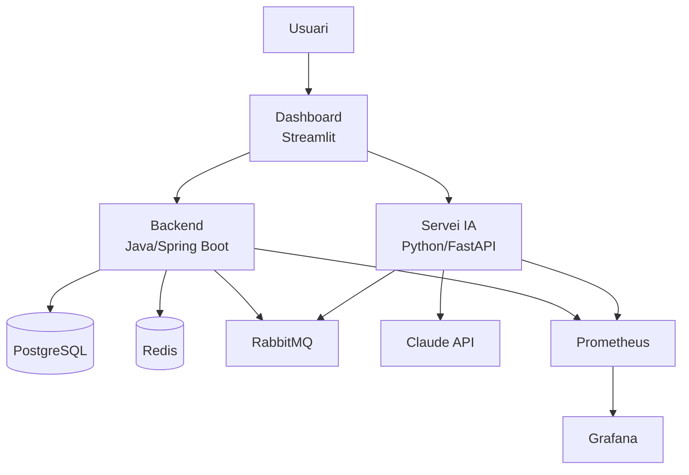

# Setmana 24 — Dimarts: GitHub Pages: Integrar el Projecte EsportsPulse

## Objectiu del Dia

Crear una pagina dedicada al projecte EsportsPulse dins del portfolio amb screenshots, diagrama d'arquitectura, stack tecnologic, i link al repositori. Configurar GitHub Actions per al desplegament automatic del portfolio. Al final del dia, el projecte estara presentat de manera professional.

---

## Teoria

### Pagines de Projecte vs Pagina Personal

GitHub Pages permet dos tipus de pagines:

```
# 1. Pagina personal (username.github.io)
#    - Una per usuari
#    - Es la "home" del teu portfolio
#    - Repositori: username.github.io

# 2. Pagina de projecte (username.github.io/repo-name)
#    - Una per repositori
#    - Documenta un projecte especific
#    - Es configura al repositori del projecte
#    - Branca: gh-pages (o docs/)
```

### Screenshots i Visuals

Una imatge val mes que mil paraules, especialment en un portfolio:

```
# Tipus de screenshots per incloure:
#
# 1. Dashboard principal (Streamlit)
#    - Captura amb dades reals o de demo
#    - Mostra la interficie d'usuari
#
# 2. Swagger UI de l'API
#    - Mostra els endpoints disponibles
#    - Dona sensacio de professionalitat
#
# 3. Grafana dashboards
#    - Mostra les metriques del sistema
#    - Demostra que tens monitoritzacio
#
# 4. Terminal amb docker-compose up
#    - Mostra tots els serveis arrancant
#    - Demostra l'orquestracio amb Docker
#
# Com fer bons screenshots:
# - Tamany consistent (1200x800px o similar)
# - Sense informacio personal visible
# - Amb dades d'exemple realistes (no "test123")
# - Format: PNG per a screenshots, GIF per a demos animades
```

### GitHub Actions per a Desplegament Automatic

Pots configurar GitHub Actions perque el portfolio es desplegui automaticament amb cada push:

```yaml
# .github/workflows/deploy-pages.yml
# Workflow que desplega el portfolio a GitHub Pages
# cada vegada que es fa push a la branca main

name: Deploy Portfolio to GitHub Pages

# Quan s'executa: cada push a main
on:
  push:
    branches: ["main"]

# Permisos necessaris per a GitHub Pages
permissions:
  contents: read
  pages: write
  id-token: write

# Nomes un desplegament a la vegada
concurrency:
  group: "pages"
  cancel-in-progress: false

jobs:
  build:
    runs-on: ubuntu-latest
    steps:
      # Descarrega el codi del repositori
      - name: Checkout
        uses: actions/checkout@v4
      
      # Configura GitHub Pages
      - name: Setup Pages
        uses: actions/configure-pages@v4
      
      # Compila amb Jekyll
      - name: Build with Jekyll
        uses: actions/jekyll-build-pages@v1
        with:
          source: ./       # Directori font
          destination: ./_site  # Directori de sortida
      
      # Puja els fitxers compilats
      - name: Upload artifact
        uses: actions/upload-pages-artifact@v3
  
  deploy:
    # El deploy s'executa despres del build
    needs: build
    runs-on: ubuntu-latest
    
    # Entorn de GitHub Pages
    environment:
      name: github-pages
      url: ${{ steps.deployment.outputs.page_url }}
    
    steps:
      # Desplega a GitHub Pages
      - name: Deploy to GitHub Pages
        id: deployment
        uses: actions/deploy-pages@v4
```

### Reutilitzant Coneixements de CI/CD

A la Setmana 7 vas aprendre CI/CD amb GitHub Actions. Ara ho apliques de manera practica:

```
# Connexio amb S7 (CI/CD):
# - Vas aprendre a crear workflows YAML
# - Vas configurar triggers (on: push)
# - Vas entendre jobs i steps
# - Ara ho uses per desplegar un lloc web
#
# Es el mateix concepte:
# CI: compilar i validar
# CD: desplegar automaticament
# La diferencia es que aqui despleguem HTML, no una app Java
```

---

## Activitat

### 1. Fer Screenshots del Projecte (20 min)

Arrenca EsportsPulse i fes captures de pantalla:

```bash
# Arrenca tots els serveis
cd ~/esportspulse-engine
docker-compose up -d

# Espera que tot estigui llest
sleep 15

# Obre les interficies que vols capturar:
# 1. Dashboard Streamlit
open http://localhost:8501

# 2. Swagger UI
open http://localhost:8080/swagger-ui/index.html

# 3. Grafana
open http://localhost:3000

# 4. RabbitMQ Management
open http://localhost:15672
```

Fes les captures i guarda-les a `assets/images/` del portfolio:

```bash
# Mou les captures al portfolio
cd ~/username.github.io
mkdir -p assets/images/esportspulse

# Copia les captures (ajusta els paths)
cp ~/Desktop/screenshot-dashboard.png assets/images/esportspulse/
cp ~/Desktop/screenshot-swagger.png assets/images/esportspulse/
cp ~/Desktop/screenshot-grafana.png assets/images/esportspulse/
```

### 2. Crear la Pagina del Projecte (30 min)

Crea `projects/esportspulse.md`:

```markdown
---
layout: default
title: EsportsPulse Engine
---

# EsportsPulse Engine

> Plataforma d'analisi d'esports electronics amb agents d'IA

## El Problema

L'analisi d'esports electronics requereix processar grans quantitats
de dades estadistiques i documentacio tecnica. Els analistes necessiten
eines que combinin dades estructurades (estadistiques) amb coneixement
no estructurat (articles, guies, analisis).

## La Solucio

EsportsPulse combina una API REST robusta amb agents d'IA especialitzats:

- **Agent Quantitatiu**: analitza estadistiques d'equips i jugadors
  usant dades de la base de dades.
- **Agent Knowledge**: recupera i sintetitza informacio de documents
  i fonts externes usant RAG.

## Screenshots

### Dashboard Principal

*Dashboard Streamlit amb visualitzacio d'estadistiques i interficie de consulta als agents.*

### API Documentation

*Documentacio interactiva de l'API generada automaticament amb OpenAPI.*

### Monitoritzacio

*Dashboard de Grafana amb metriques de rendiment del sistema.*

## Arquitectura



## Stack Tecnologic

| Capa | Tecnologia | Per Que |
|------|-----------|---------|
| Backend | Java 21 + Spring Boot 3.2 | Robustesa i ecosistema madur |
| AI Service | Python 3.12 + FastAPI | Ecosistema de ML i velocitat |
| Agents | LangChain + Claude | Capacitat d'analisi avancada |
| Database | PostgreSQL 16 | Fiabilitat i SQL complet |
| Cache | Redis 7 | Rendiment i sessions |
| Messaging | RabbitMQ 3.13 | Comunicacio asincrona |
| Monitoring | Prometheus + Grafana | Observabilitat professional |
| Container | Docker + Compose | Reproduibilitat |
| CI/CD | GitHub Actions | Automatitzacio |
| Cloud | Render / Fly.io | Desplegament senzill |

## Decisions Tecniques Clau

### Per que dos serveis separats (Java + Python)?
<!-- Explica la decisio arquitectonica -->
Java per al backend de dades (ecosistema madur, tipat fort, JPA)
i Python per als agents (LangChain, ecosistema de ML).
La comunicacio via REST i RabbitMQ permet escalar-los independentment.

### Per que agents en comptes de crides directes a l'LLM?
<!-- Explica per que un agent es millor que un prompt simple -->
Els agents poden decidir quines eines usar basant-se en la pregunta.
Aixo fa el sistema mes flexible que prompts fixos.

### Per que Redis + RabbitMQ?
<!-- Explica les decisions d'infraestructura -->
Redis per a cache de resultats d'agents (redueix costos d'API).
RabbitMQ per a processos llargs (l'agent pot trigar 10+ segons).

## Links

- [Repositori GitHub](https://github.com/username/esportspulse-engine)
- [Demo en viu](https://app.esportspulse.dev)
- [Documentacio API](https://api.esportspulse.dev/swagger-ui/index.html)

[Tornar al Portfolio](/)
```

### 3. Configurar GitHub Actions (15 min)

Crea `.github/workflows/deploy-pages.yml` amb el contingut de la seccio de teoria.

```bash
cd ~/username.github.io
mkdir -p .github/workflows
```

Escriu el workflow YAML que compila Jekyll i desplega a GitHub Pages.

### 4. Configurar GitHub Pages amb Actions (10 min)

A GitHub:
1. Ves al repositori `username.github.io`.
2. Settings -> Pages.
3. Source: "GitHub Actions" (en comptes de "Deploy from branch").
4. Fes push del workflow.

```bash
git add -A
git commit -m "feat: add EsportsPulse project page and GitHub Actions deployment"
git push
```

5. Ves a Actions al repositori i verifica que el workflow s'executa.

### 5. Personalitzar l'Estil (20 min)

Afegeix estils per a les pagines de projecte:

```scss
// assets/css/style.scss — Estils addicionals

// Imatges de projecte amb borde i ombra
.project-screenshot {
  max-width: 100%;
  border: 1px solid #ddd;
  border-radius: 8px;
  box-shadow: 0 2px 8px rgba(0, 0, 0, 0.1);
  margin: 1em 0;
}

// Taula d'stack tecnologic
table {
  width: 100%;
  border-collapse: collapse;
  margin: 1em 0;
}

table th {
  background-color: #f6f8fa;
  padding: 8px 12px;
  text-align: left;
  border-bottom: 2px solid #d1d5da;
}

table td {
  padding: 8px 12px;
  border-bottom: 1px solid #e1e4e8;
}
```

### 6. Verificar el Desplegament (10 min)

```bash
# Espera que el workflow acabi (1-2 minuts)
# Despres verifica:
curl -I https://username.github.io/projects/esportspulse

# Obre al navegador
open https://username.github.io
```

Verifica:
- La pagina principal carrega correctament
- El link al projecte EsportsPulse funciona
- Les imatges es veuen
- El diagrama Mermaid es renderitza (o esta com a text)

---

## Checklist de Lliurament

- [ ] Screenshots del projecte fets (dashboard, Swagger, Grafana)
- [ ] Pagina dedicada a EsportsPulse creada
- [ ] Arquitectura, stack, i decisions tecniques documentades
- [ ] GitHub Actions workflow configurat i funcional
- [ ] Desplegament automatic verificat (push -> deploy)
- [ ] Estils personalitzats per a imatges i taules
- [ ] Pagina accessible i amb bon aspecte visual
- [ ] Links al repositori i demo funcionant
- [ ] Commit i push al repositori del portfolio
